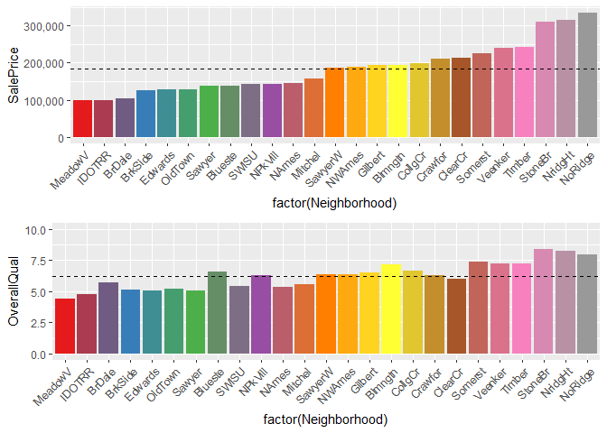
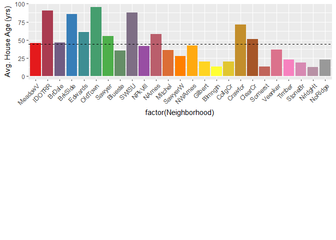

Statistical Analysis 5.3 Report
================
Jason Wilcox
July 1, 2018

SalePrice
=========

Having thousands of data points on a diverse group of houses, there are many interesting data points to discuss. There were some very obvious ways to initially look at the data but I also discovered more abstract ways to see it too. Some important findings to my data analysis included simple comparison of sale price with basic things such as house size, age, etc but also some interested things were seen when comparing houses by neighborhoods to see trends across the city.

Initially, the very first thing I wanted to see was sale price shown by count. This gives a quick idea of how the data is represented. As can be seen below, the sale price is roughly normal, skewed to the right slightly which makes sense, considering there isn't an upper limit on housing prices and expensive houses can be built anywhere. There appears to be a noticeable dip in value near where the mean and median area. One goal is to understand why this occurs.Also of note, there are 1459 NA's, which are the missing values to be predicted for SalePrice.

    ##    Min. 1st Qu.  Median    Mean 3rd Qu.    Max.    NA's 
    ##   34900  129975  163000  180921  214000  755000    1459

House Size
==========

The first predictable analysis I did was sale price vs house size. I used the sum of the basement, 1st, and 2nd floor square footage to create a scatter plot of the various house sizes and what they sold for. As expected, there was a strong trend for the larger the house, the more it sold for. There appear to be a few exceptions (houses 1299 and 524) which appear to have sold for significantly less than expected for the size. I plan on looking into this more to determine the reasons that these houses could be valued so low, perhaps they are old, or the quality is very low. Those were my initial thoughts and a quick look at the data shows they were both recently built (2008 and 2007) and have been given an "OverallQual" value of 10, the highest (and also the most influential variable for SalePrice based on correlation). So it will be interesting to determine why those two houses are much lower in price.

Overall Quality
===============

Using a correlation plot, I was able to determine that OverallQual had the largest effect on SalePrice, having a correlation value of 0.79. I wanted to better understand just how much impact OverallQual had so I decided to make a graph. I was surprised to actually see that OverallQual which "Rates the overall materiel and finish of the houses", which would also be subjective bias from whoever was giving the ratings, was so strongly related. As quality rating goes up, so does the value of the house (which makes sense). There also appears to be a large change in rate between 6 and 7, suggesting that materials with quality of 7 or higher have greater impact on increasing a home's value per unit.

Neighborhood
============

Lastly, to look at things a little differently I decided to group everything by neighborhood to see what trends there were by different areas of the city, and wasn't surprised when I noticed some significant differences. Most people know that cities have both good and bad neighborhoods which can be determined by a number of things, including the type and quality of houses, distance to and quality of schools, hospitals, churches, police, and crime rates. First, I ranked the neighborhoods in ascending order by average SalePrice for the homes for each and marked the mean with a dashed line. I then used the same ascending order to show each neighborhood's OverallQual, SquareFootage, LotArea, and average age of house. Stitching the plots together then allows for simple and easy comparison. Looking at OverallQual, there are some neighborhoods that appear to have houses which have higher quality relative to their SalePrice, such as in Blueste. This means that some homes are selling for less than their true value and would be a great purchase. With the house size graph, some neighborhoods have houses larger than those of similar value, such as in SWISU neighborhood and could provide a large family a lower priced home than potentially elsewhere in the city. Lot Area and house age provided some insight to the other graphs by having less apparent trends due to more outliers but still providing useful information. Neighborhoods that had more expensive homes tend to also have larger plots of land and be newer, but not always.

Conclusion
==========

There is quite a lot of data still to be looked at and understand what is going on. I have some questions already to look deeper for the answers and know many more will show up as I dig deeper. There will be more need to analyze the factor variables as well for the influences they may have on the value of homes, which can't be as easily quantified as the initial data was since it was numeric.
